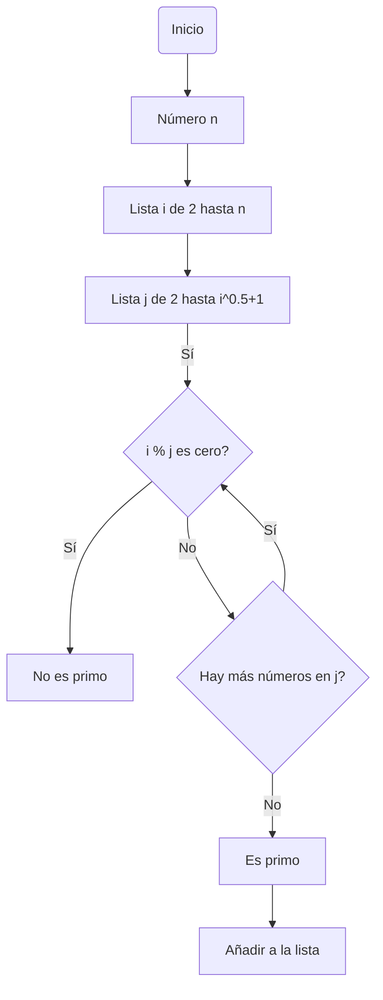
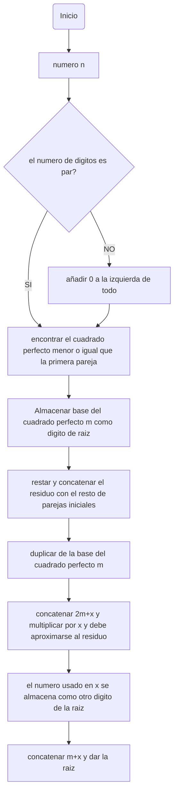

# Reto Nro. 3
En este repo se encontrarán los diagramas de flujo y pseudocódigos asociados a cada problema planteado
## Numeros primos hasta n
### Diagrama de flujo 

### Pseudocódigo 
```pseudocode
  Inicio

Leer n
Para i desde 2 hasta n hacer
    EncontrarDivisor = Verdadero
    Para j desde 2 hasta raíz cuadrada de i + 1 hacer
        Si el residuo de i dividido por j es igual a 0 entonces
            EncontrarDivisor = Falso
            Salir del bucle interno
        Fin Si
    Fin Para

    Si EncontrarDivisor es Verdadero entonces
        Añadir i a la lista de números primos
    Fin Si
Fin Para

Fin
```
## Procedimiento matemático para hallar raíces cuadradad
### Diagrama de flujo 

### Pseudocódigo
```pseudocode
Inicio
    Leer numero n
    Si el numero de digitos de n es impar Entonces
        Añadir 0 a la izquierda de todo
    FinSi
    Encontrar el cuadrado perfecto menor o igual que la primera pareja de dígitos de n
    Almacenar la base del cuadrado perfecto encontrado como dígito de la raíz (m)
    Restar el cuadrado perfecto de la primera pareja y concatenar el residuo con el resto de parejas de dígitos de n
        Duplicar el valor de m
        Para cada dígito x hacer
            Concatenar 2m con x (formando un nuevo número 2m+x) y multiplicar por x
            Si 2m+x multiplicado por x se aproxima al residuo actual sin superarlo Entonces
                El número x se almacena como otro dígito de la raíz
                Actualizar m concatenando m con x
            FinSi
        FinPara
    La raíz cuadrada aproximada de n es el valor final de m
Fin

```


