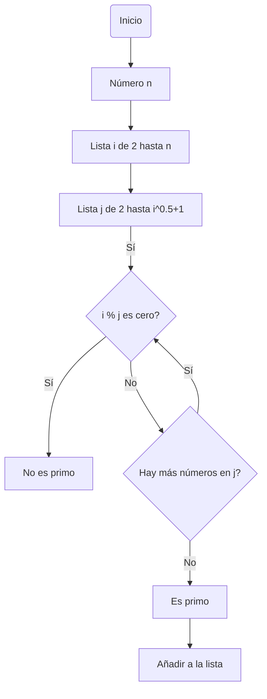

# Reto Nro. 3
En este repo se encontrarán los diagramas de flujo y pseudocódigos asociados a cada problema planteado
## Numeros primos hasta n
### Diagrama de flujo 

### Pseudocódigo 
```pseudocode
  Inicio

Leer n
Para i desde 2 hasta n hacer
    EncontrarDivisor = Verdadero
    Para j desde 2 hasta raíz cuadrada de i + 1 hacer
        Si el residuo de i dividido por j es igual a 0 entonces
            EncontrarDivisor = Falso
            Salir del bucle interno
        Fin Si
    Fin Para

    Si EncontrarDivisor es Verdadero entonces
        Añadir i a la lista de números primos
    Fin Si
Fin Para

Fin
```
## Procedimiento matemático para hallar raíces cuadradad
### Diagrama de flujo 
```mermaid

```
### Pseudocódigo
```pseudocode

```


